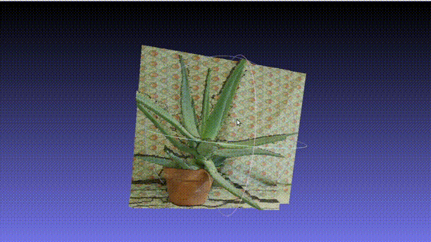

# Repositorio del Proyecto Final de Computación Gráfica
 
- Profesor: 
Dr. Juan Carlos Gutierrez Caceres

## Integrantes:
- Jair Huamán Canqui
- Jhunior Chavez Cruz
- Hayde Humpire Cutipa
- Katerine Cruz Valdivia

## Preliminares
- Moldeado 3D a partir de imágenes 2D
- Entrada: 2 o más imágenes en distintos ángulos del mismo objeto
- Salida: Malla a partir de nube de puntos (molde 3D), previo análisis de keypoints, matching, triangulación

## Pruebas

### Prueba 1 (Imagen vía web)
#### Entrada

#### Salida
 

### Prueba 2 (Fotos vía celular)
#### Entrada

#### Salida

### Prueba 3 (Fotos vía web)
#### Entrada

#### Salida
 

